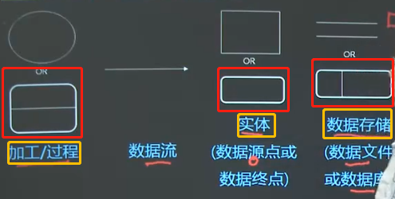
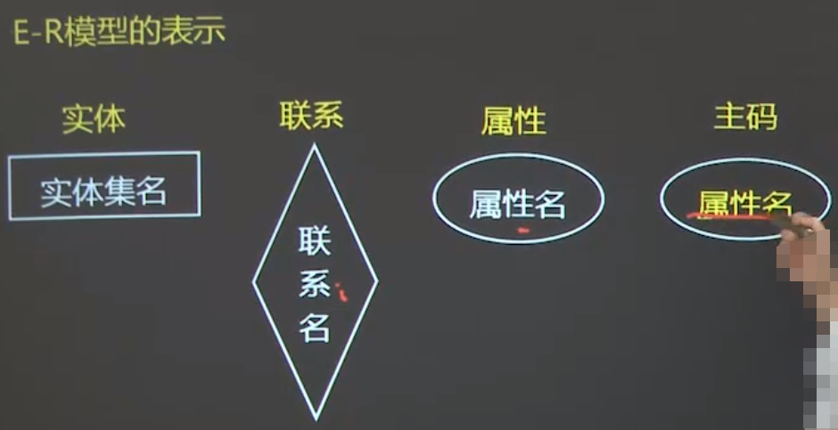
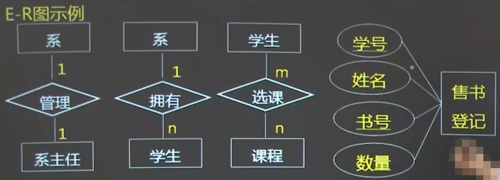
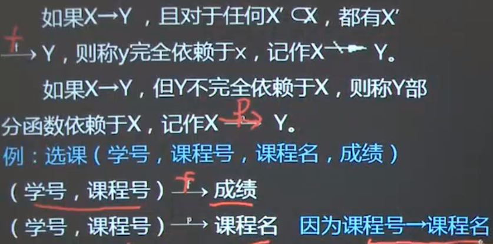

## 三级数据库

----
### 数据库基本概念
- 数据库 —— Database，简称DB
- 数据库系统 —— Database System，简称DBS
- 数据库管理系统 —— Database Manage System，简称DBMS 
- 数据库应用系统 —— Database Application System，简称DBAS
### 软件工程与数据库技术
- 数据库应用系统的开发必须要有 **软件工程** 模型作为指导
- 典型的软件工程模型
    1. 瀑布模型
    2. 快速原型模型
    3. 螺旋模型
### DBAS的生命周期
- DBAS的生命周期由**项目规划、需求分析、系统设计、实现与部署、运行管理与维护**等五个基本活动组成
- DBAS三条设计主线**数据组织与存储设计、数据访问与处理设计、应用设计**分别用于设计数据库，数据库事务和应用程序
- 根据数据库系统三级模式结构（外模式、模式、内模式），DBAS的设计阶段分为**概念设计、逻辑设计、物理设计**三个步骤，每一步设计内容涵盖了三条设计主线
1. 规划与分析
    1. **系统规划与定义**：确定用户视图
    2. **可行性分析**：经济操作等
    3. **项目规划**：项目团队、环境、预算等
2. **需求分析过程**由
    1. 需求获取
    2. 需求分析
    3. 需求描述与规范说明
    4. 需求验证
3. 系统设计
    1. **概念设计**：数据库概念模型设计、系统总体设计
    2. **逻辑设计**：数据库逻辑结构设计、应用设计概要设计、数据库事务概要设计
    3. **物理设计**：数据库物理机构设计、数据库事务详细设计、应用程序详细设计
    
### 需求分析
1. 需求分析
    > 目标：描述软件的**功能**和**性能**
    - 需求分析的困难
        1. 软件功能复杂
        2. 需求的**可变性**
        3. 软件产品的**不可见性**
    - 需求获取的方法
        1. 面谈 
        2. 实地观察
        3. 问卷调查
        4. 查阅资料
    - 需求获取的过程
        1. **标识问题**
        2. 建立**需求模型** 
        3. 描述需求
        4. 确认需求
2. 需求分析方法
    - 结构化分析与建模方法（SAD）
        > DFD建模、IDEF建模
        - 结构化分析（SA）任务
            1. 建立分析模型：SA模型是描述软件需求的一组模型，主要包括**功能模型、数据模型、结构模型**
            2. 编写需求文档规格说明书：SAS是分析阶段编写的以文字为主的文档，主要内容包括：**引言、信息描述、功能描述、行为描述、质量保证、接口描述等**
            3. 结构化分析的主导思想：抽象和分解
        - DFD建模方法（功能建模）
            1. **数据流图（Data Flow Diagram，DFD）**，DFD的核心是数据流，以**图形**方法来表示
                > DFD图的基本符号
                 
                 
            2.DFD建模方法的基本元素
                - 数据流
                - 数据处理
                - 数据储存
                - 数据源（数据结点）
        - IDEF0需求建模方法（选择考点）
            - IDEF方法（共16套方法）
            - 最常使用的是IDEF0 ~ IDEF4
                1. IDEF0：描述系统功能相互关系     
                2. IDEF1：系统信息及其数据之间联系
                3. IDEF2：系统模拟，动态模拟
                4. IDEF3：过程描述及获取方法
                5. IDEF4：面向对象设计
            
    - 面向对象分析与建模方法（OOAD）
        > UML用例建模（OOA）
### 数据库结构设计
1. 数据库概念设计
    - 数据库概念设计（**数据库设计的核心环节**）
        > 独立于DBMS的概念模型
    
    - 概念设计的依据和过程
        - 依据：数据库概念设计以 **需求分析结果(需求说明书、DFD图、各类报表)** 作为依据
        - 结果：概念设计的**结果**是概念模型（ER）与概念设计说明书。
        - 过程：
            1. 明确建模目标（模型覆盖范围）
            2. 定义实体集（自底向上标识和定义实体集）
            3. 定义联系（实体间关联关系）
            4. 建立信息模型（**构造ER模型**）
            5. 等
    - 概念模型设计
        - 概念设计目前采用最广泛的的是**ER建模方法**
        - **E-R模型（Entity Relationship Model）**即实体联系模型
    - 与E-R有关的概念
        - 实体（Entity）或实例（Instance）
            > **客观存在**并可**相互区分的事物**叫实体。如"学生张三"工人李四""计算机系"
        - 实体集（Entity Set）
            > **同型实体的集合**成为实体集。如'全体学生'
        - 属性（Attribute）
            > 实体所具有的某一特征,称为属性，每个属性的取值范围称为‘域’ 
        - 码（key）：键
            > **唯一标识**每个实体的属性或属性集合
        - 联系（Relationship）
            > 描述实习之间的相互关系
            
            - 联系有"一对一"、"一对多"、"多对多"
    - E-R模型的标识
        
    - E-R图实例
        
2. 数据库逻辑设计
    > 主要的三种数据类型：层次模型、网状模型、**关系模型**（简单、灵活）
    - 关系模式
        1. 关系模型就是用**二维表格结构**来标识实体与实体之间联系的模型
        2. 关系的描述称为关系模式（Relation Schema）
    - **关系数据库设计的核心**：关系模式的设计
    新奥尔良法，数据库设计步骤：
        > 需求分析 -> 概念结构设计（E-R图） -> 逻辑设计（关系模式设计） -> 物理设计
    - 数据依赖
        > 函数就是**唯一**确定的关系，而多值依赖却**不能确定唯一关系**
        - 概念
            > 关系内部属性与属性之间的一种**约束**关系
        - 函数依赖（Functional Dependency，FD）
            > 类似于数学中的函数 y=f(x)
        - 多值依赖（MD）
        - 函数依赖的集中特例
            1. 平凡函数依赖与非平凡函数依赖
                - 如果 X →（符号：依赖；读Y依赖于X） y，且Y不是X的子集，则X → Y称为非平凡函数依赖。
                - 如果 Y是X的子集，则X → Y是平凡函数依赖 
            2. 完全函数依赖与部分函数依赖
            
                
                
                > 如果X → Y，且X是单个属性，则X --p> Y
                
            3. 传递函数依赖
                > 如果X → Y，Y → Z，则X 传递→ Z（读：Z传递依赖于X）
    - 候选码、主码、外码
        1. 候选码：如果某属性的值能够唯一确定整个元组的值，则该属性组为候选码或候选关键字
                > 候选码如果有多个。可以选其中一个作为**主码**（Primary Key）
        2. 外码也称为外键
    - 数据规范化
        - 关系模式设计的好坏直接影响到数据库设计的成败。
        - 关系模式的规范化主要是由**关系范式**来实现
        - 关系模式规范化：把一个低一级的关系模式分解为高一级的关系模式的过程
        - 关系数据库的规范化管理理论是**数据库逻辑设计的工具**
    - 范式
       > 关系模式满足的**约束条件**称为范式
       - 1NF 如果关系模式R，其中所有属性都是不可再分的基本数据项，则称R为第一范式
       - 2NF 如果关系模式R为1NF，且每个非主属性**完全函数依赖于**主码，则称R属于第二范式
       - 3NF 如果关系模式R为2NF，R中每个非主属性**不传递依赖于**R的主码
    - 数据库逻辑设计方法
        1. 将概念结构转换为一般的关系模型
        2. 将转化来的关系模型向特定DBMS支持下的数据模型转换
        3. 对数据模型进行优化
3. 数据库物理设计
    - 物理设计概述：物理数据库设计是设计数据库的存储结构和物理实现方法。 
    - 数据库的物理结构
        - **物理设备上**的**存储结构**与**存储方法**
        - 数据库的数据以文件（物理文件）形式存储在外设存储介质上
        - 数据库的物理结构需要的问题
            1. 文件组织
            2. 文件结构
            3. 文件存取
            4. 索引技术
        - 索引
            - 是数据库中独立的存储结构
            - 索引技术是快速数据访问技术
            - 索引技术的关键
            - 索引能提高性能，但是有代价的
                > 设计和创建索引时，应确保对**性能的提高程度大**于在**存储空间和处理资源方面的代价**。
                1. 有序索引
                    > 
                    - 聚集索引（索引项与数据记录排列顺序一致，索引顺利文件）和非聚集索引
                        > 一个数据文件只能建立一个聚集索引，但可以建立多个非聚集索引。
                    - 稠密索引（数据文件中每个查找嘛都对应索引记录）和非聚集索引（部分查找码的值对应索引记录）
                    - 主索引（主码属性集上建立的索引）与辅索引（非主属性建立的索引）
                    - 唯一索引（索引列不包含重复值）
                    - 单层索引（线性索引）多层索引（采用多层树形结构）
                2. 聚集索引
                3. 散列索引
    - 数据库的物理设计
        > 目标：储存空间占用少，数据访问效率高，维护代价低
        1. 数据库逻辑模式描述
        2. 文件组织与存取设计
            > 将易变部分与稳定部分存取频率较高部分与存取频率较低部分分开存放，以提高系统性能
        3. 数据分布设计
        
### 数据库应用系统设计与实施
1. 软件体系结构与设计过程
    - 软件体系架构
        1. 软件体系架构 = { **构建，连接件，约束** }
        2. 软件体系结构有多种风格类型：
            - 分层体系架构
            - MVC体系架构
            - 客户端/服务器体系架构
    - 软件设计过程
        > 软件设计包括概要设计和详细设计
        1. 概要设计的任务是进行**软件总体结构设计**，可采用层次结构图建立**软件总体结构图**
        2. 详细设计的任务是进行**数据设计，过程设计，人机界面设计**
        3.设计原则：模块化、信息隐藏、抽象、逐渐求精。
2. DBAS总体设计
    > 任务：**确定系统总体框架**
    - DBAS体系结构设计
        > 将系统从**功能、结构/层次、地理分布**等进行分解
        - 两种常见的体系架构
            - 客户、服务器体系架构（C/S）client/server
            - 流浪器/服务器体系架构（B/S）browser/server
    - 软件体系结构设计
    - 软件硬件选型与配置设计
    - 业务规划初步设计
3.  33
    
       
            
           
            
    
    
    

    

    

    